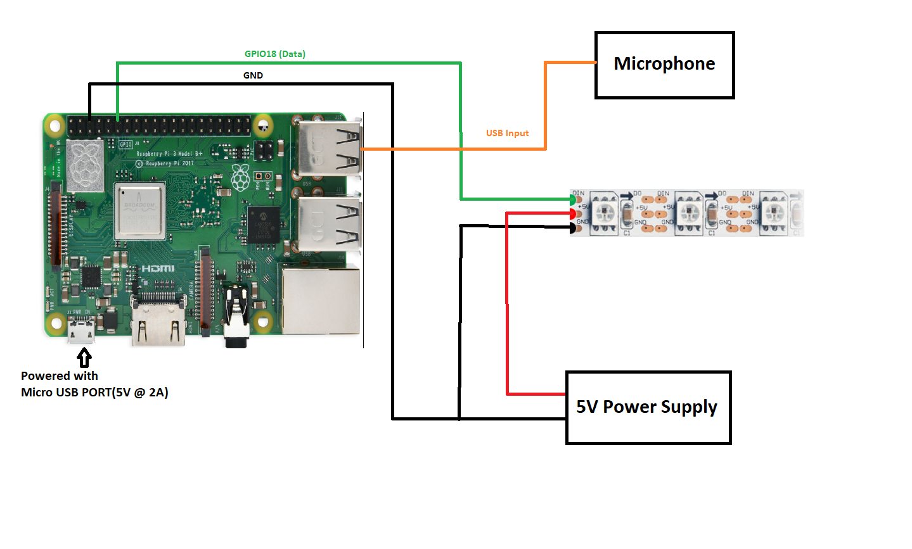

# Controlling LED animations through Python Socket and Google Speech-To-Text

## Hardware 
* Raspberry Pi 3 Model B+
* WS2812B Led Strip
* USB Microphone
* 5V Power Supply

## Libraries
* NeoPixel (https://github.com/jgarff/rpi_ws281x)
* SpeechRecognition (https://pypi.org/project/SpeechRecognition/)

## Circuit

